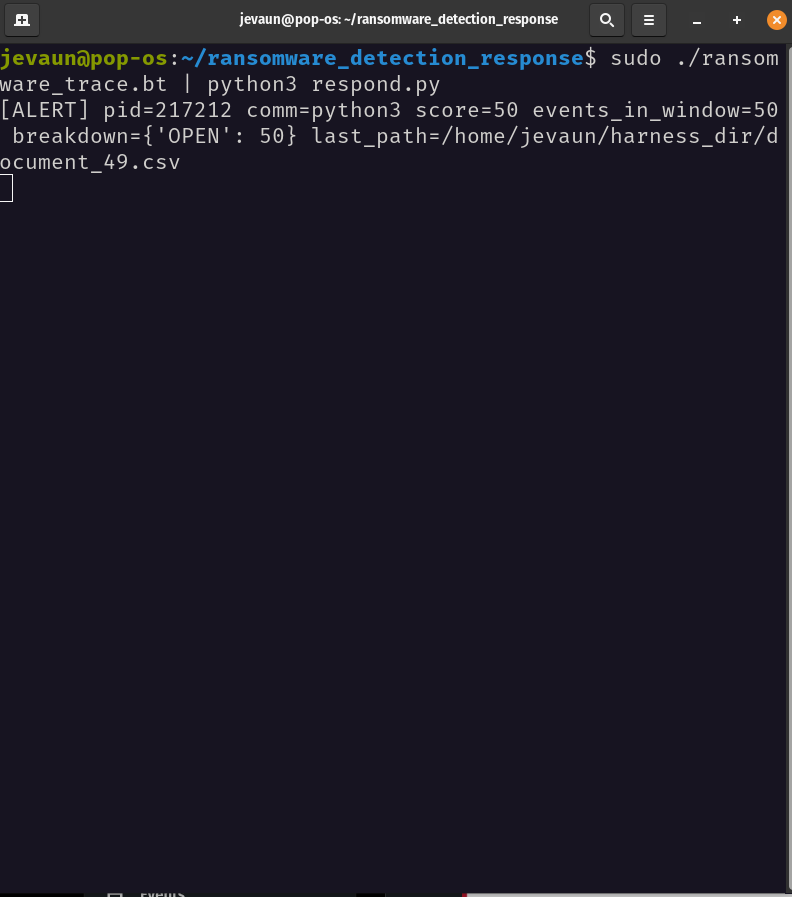

# linux_ransomware_detection_response

Detects processes showing signs of ransomware-like behavior on Linux and
freezes them before they can do further damage. Nothing gets killed permanently, just paused.
So, if it stops something legit, you can bring it right back!

> **Warning:** This tool stops processes for real, and it does so by default.
> There's no dry-run mode. Try it in a VM or test box, not on a machine you
> depend on.

## Why this exists

Built this to scratch a mental itch, honestly. It's an educational project,
not a product. Fair warning: it includes ransomware-like code (Python and
Bash) that does file encryption via XOR. The encryption type is simple, but functionally the
same category of behavior. It's in here so the detector/response side has
something realistic to catch and react to, not because I'm trying to hand
anyone a working ransomware kit.

Don't run the encryption code against anything you care about, and don't
point it at a shared or production machine. Same rules as the SIGSTOP
warning above: sandbox only.


## See it in action

[

* There's a 2-minute walkthrough video in the multimedia directory. It will show what it does and what it looks like when it fires.

  
## What it does

- Watches for [what gets flagged: suspicious behavior, specific processes, etc.]
- Sends `SIGSTOP` to pause the flagged process (fully reversible)
- Logs every decision to `actions.log`, including the ones it skipped



## Built-in safety rails

It won't touch:

- **Low PIDs** (below `PID_FLOOR` [respond.py], default 1000), so core system stuff is safe
- **Itself**, so it can't freeze its own process
- **Root-owned processes**, unless you flip `ALLOW_ROOT = True`

## Getting started

```bash
git clone https://github.com/jevaunD/linux_ransomware_detection_response.git
cd linux_ransomware_detection_response

# Ubuntu / Debian
sudo apt update
sudo apt install bpftrace

# Fedora
sudo dnf install bpftrace

# Arch
sudo pacman -S bpftrace

# Verify installation
bpftrace --version

#create test target files

 python3 create_files.py <<target_directory>> <<number of files>>

# Start monitoring and response program
sudo ./ransomware_trace.bt | python3 respond.py

#Run ransomware simulation program (ransomware_sim.py or rans.sh)

python3 ransomware_sim.py
OR
bash rans.sh

```

**Requirements:** Linux, Python 3.[x]+, bpftrace.

## Config

| Setting      | Default       | What it does                               |
|--------------|---------------|--------------------------------------------|
| `PID_FLOOR`  | `1000`        | PIDs below this are never touched          |
| `ALLOW_ROOT` | `False`       | Set `True` to allow acting on root process |
| `LOG_FILE`   | `actions.log` | Where decisions get logged                 |

## Oops, it stopped something I need

No panic. Paused processes pick up exactly where they left off.

1. Find the PID in `actions.log`, or list paused processes:
```bash
   ps -eo pid,stat,comm | awk '$2 ~ /^T/'
```
2. Resume it:
```bash
   kill -CONT <pid>
```
   Or by name: `pkill -CONT <process_name>`


## The log

Every action gets a timestamped line, whether it stopped something or skipped it:

```
2026-09-20 14:32:07 -> [example_process]:4821 stopped (SIGSTOP)
2026-09-20 14:32:09 -> [example_process]:812 SKIPPED (protected PID)
```

## Docs

Full details are in [`system-software-requirements.md`](./linux_ransomware_detection_response/system-software-requirements.md).


Issues and PRs welcome!

## License

MIT License

Copyright (c) 2026 Jevaun Smith

Permission is hereby granted, free of charge, to any person obtaining a copy of this software and associated documentation files...

Built with curiosity. Maintained with feedback.
